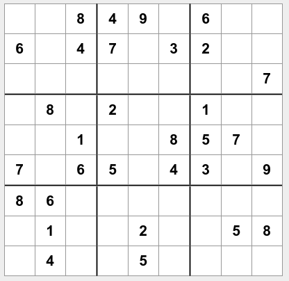

# Trabajo I - Sudoku

## Nota Máxima: 7 puntos

El trabajo consiste en hacer un programa que para jugar al SUDOKU. 

Los SUDOKUS deben estar guardados en un archivo de texto con el siguiente formato

```
- - 8 4 9 - 6 - -
6 - 4 6 - 3 2 - -
- - - - - - - - 7
- 8 - 2 - - 1 - -
- - 1 - - 8 5 7 -
7 - 6 5 - 4 3 - 9
8 6 - - - - - - -
- 1 - - 2 - - 5 8
- 4 - - 5 - - - - 
```
Que representaría el sudoku de la imagen



El programa debe 
  - Tener 5 sudokus guardados en 5 archivos.
  - Cargar cada vez que se juega un sudoku aleatoriamente.
  - Permitir al usuario elegir que fila y columna quiere rellenar
  - Completar el sudoku con la fila/columna y el valor elegido.
  - Cada vez que se completa un cuadrante/fila/columna se debe comprobar que están todos los números del 1 al 9
  - Si el usuario completa una fila/columna/cuadrante de modo incorrecto acaba la partida.
  - Cuando estén completas todas las casillas finaliza el juego.
